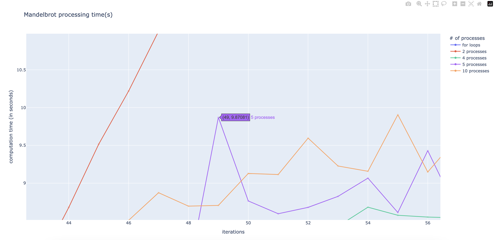
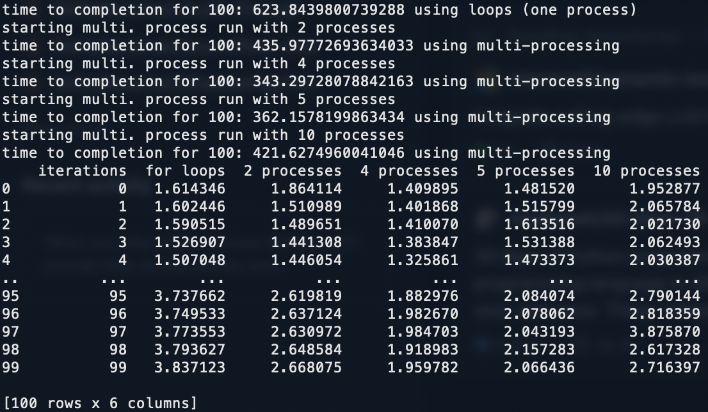
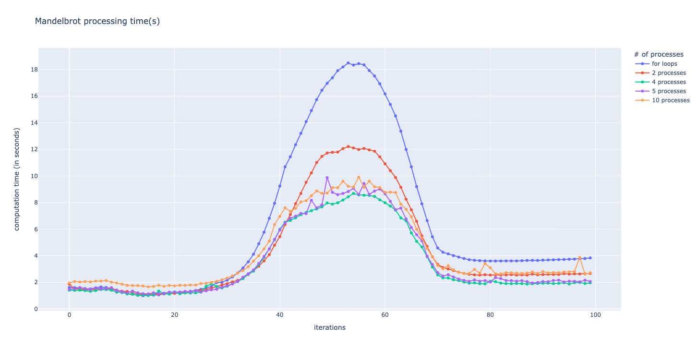

# MandelbrotSet

this program visualizes the Mandelbrot Set and adds some wacky colors as well.

### Methods

mandelbrot-v2.py adds a new function that enables multi-processing
-> the # of processes can be set
-> via opencv, each mandelbrot "frame" is displayed in the same window emulating a (somewhat) smooth video type thing
-> there is a function that uses 'ffmpeg' to create a video from the generated photos

### Analysis

I used plotly to implement a basic UI dashboard that displays the time taken (y-axis) for each iteration (x-axis)
